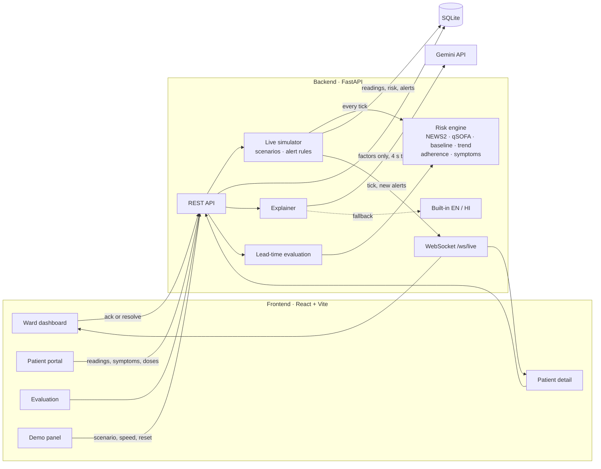

# AYU — Intelligent Early Health-Risk Detection & Decision Support

[](https://github.com/Argonyx-26/T3-Nexora/actions/workflows/ci.yml)

**Team AYU · Argonyx'26, RV University** — Ishan Sharma (lead), Aryan Verma, Harshit Kandpal, Vinay

> Hospitals use NEWS2, which applies the same thresholds to everyone. AYU adds a **personal baseline** for each
> patient plus **trend detection**, so it catches deterioration earlier — and it explains every alert in plain language.

> ⚠️ **AYU is decision support, not diagnosis. Final clinical judgment rests with the doctor.**

## The problem

Early warning scores like NEWS2 compare every patient with the same fixed thresholds. That fails in two directions:

- **Slow deterioration hides inside "normal".** SpO₂ sliding from 97% to 94% over three hours scores almost nothing,
  and a runner whose resting heart rate is 52 can reach 85 before NEWS2 notices anything.
- **Some patients live on the thresholds.** A heart-failure or COPD patient's usual readings trip alarms on a quiet day,
  and staff learn to ignore them.

Missed doses of critical medicines (insulin, antihypertensives) and reported symptoms are not part of NEWS2 at all.

## What AYU does

- **Watches** vitals every five minutes, plus symptoms and medication adherence, for every patient on a live ward.
- **Scores risk 0–100** from NEWS2, a qSOFA sepsis screen, the patient's **own 7-day baseline**, a **3-hour trend**,
  missed critical doses and red-flag symptoms. Every point is a named factor, and the factors add up to the score.
- **Never less alarming than NEWS2:** escalation floors lift AYU to at least the level NEWS2 would.
- **Alerts** doctors on a dashboard sorted by risk, with a toast and a chime. An alert escalates in place instead of
  spamming, and a single odd reading can't raise one.
- **Explains** each score in 2–3 sentences for the doctor and one for the patient, in **English or हिंदी**
  (Gemini, with an instant offline fallback).
- **Reaches patients** through a portal where they, or an **ASHA worker** on a shared phone, log readings, symptoms and
  doses.

## Results

`/evaluation` runs every deterioration scenario on the patients it suits over 5 seeds (55 runs, 8 hours each), and every
patient at rest for 50 patient-days. It compares like with like on two tiers:

| | Urgent review — NEWS2 ≥ 5 vs AYU Warning | First alert — NEWS2 ≥ 5 or a single 3 vs AYU Watch (confirmed) |
|---|---|---|
| **Median head start for AYU** | **65 min** (0 min – 4.6 h) | **88 min** |
| AYU first · tied · NEWS2 first | **48 · 7 · 0** | 50 · 0 · 5 |
| NEWS2 never escalated (of 55) | 6 — all missed insulin | 5 |
| False alarms at rest (50 patient-days) | AYU 2 · NEWS2 2 | **AYU 0 · NEWS2 5** |

| Scenario (urgent tier) | NEWS2 | AYU | Head start |
|---|---|---|---|
| Sepsis | 2.7 h | 2.0 h | 50 min |
| Hypoxia | 2.9 h | 2.6 h | 13 min |
| Hypertensive crisis | 3.9 h | 1.7 h | 2.3 h |
| Cardiac event | 2.8 h | 1.5 h | 75 min |
| Missed medication | 6.2 h (never in 6/10) | 2.5 h | 4.1 h |

AYU can never be later than NEWS2 at the urgent tier, by construction; ties are reported rather than hidden. Where
NEWS2 is first on the looser first-alert tier, it is single noisy readings on patients whose normal sits on its
thresholds — the same patients where it also raises false alarms at rest.
**Synthetic data, not clinical validation.** Reproduce with `GET /eval/lead-time` or
[`backend/app/eval/leadtime.py`](backend/app/eval/leadtime.py).

## Screenshots

| Screen | Route | Screenshot |
|---|---|---|
| Landing — live ECG canvas and scroll story | `/` | _to add: `docs/screenshots/landing.png`_ |
| Ward dashboard with alerts | `/doctor` | _to add: `docs/screenshots/ward.png`_ |
| Patient detail — baseline-banded charts, explanation | `/patients/P003` | _to add: `docs/screenshots/patient.png`_ |
| Evaluation — the proof | `/evaluation` | _to add: `docs/screenshots/evaluation.png`_ |
| Patient portal, Hindi, ASHA mode | `/patient/P005` | _to add: `docs/screenshots/portal.png`_ |
| Demo control panel | `/demo` | _to add: `docs/screenshots/demo.png`_ |

## Architecture



- **One engine everywhere.** The live ward, the portal, the explanations and the evaluation all call the same pure
  function, `risk.assess()`, so what the judges see live is what the evaluation measured.
- **Offline-first.** No external service is needed to run the demo; Gemini only improves the wording.

## How the risk engine works

`backend/app/risk/` is pure Python — no database, no web framework — and every tunable number lives in
[`weights.py`](backend/app/risk/weights.py).

| # | Component | What it does |
|---|-----------|--------------|
| 1 | **NEWS2** | Official RCP chart (below). Scale 2 SpO₂ for patients with a prescribed 88–92% target (COPD). |
| 2 | **qSOFA** | RR ≥ 22, SBP ≤ 100, altered mentation; ≥ 2 → sepsis-risk flag. |
| 3 | **Personal baseline** | Median and MAD-σ of the last 7 days, **excluding the last 6 h** so a slow decline can't teach itself "normal". Flags \|z\| ≥ 2.5 or ≥ 20% change, in the concerning direction only. |
| 4 | **Trend** | Least-squares slope over the last 3 h. Flagged when steep enough *and* ≥ 3 standard errors from zero, with the error widened for autocorrelation — so noise can't fake a trend. |
| 5 | **Medication** | 7-day adherence %, plus missed *critical* doses (insulin, antihypertensives, anticoagulants) in the last 24 h. |
| 6 | **Symptoms** | Weighted red flags; chest pain, one-sided weakness, slurred speech, fainting, new confusion and coughing blood escalate at once. |
| 7 | **Score** | 0–100 → Stable (0–24) · Watch (25–49) · Warning (50–74) · Critical (75+). Each group is capped; escalation floors mean AYU is never *less* alarming than NEWS2. Every point is a named **contributing factor**. |

### NEWS2 chart

| Parameter | 3 | 2 | 1 | 0 | 1 | 2 | 3 |
|---|---|---|---|---|---|---|---|
| Resp. rate | ≤ 8 | | 9–11 | 12–20 | | 21–24 | ≥ 25 |
| SpO₂ scale 1 | ≤ 91 | 92–93 | 94–95 | ≥ 96 | | | |
| Air or oxygen | | Oxygen | | Air | | | |
| Temperature °C | ≤ 35.0 | | 35.1–36.0 | 36.1–38.0 | 38.1–39.0 | ≥ 39.1 | |
| Systolic BP | ≤ 90 | 91–100 | 101–110 | 111–219 | | | ≥ 220 |
| Heart rate | ≤ 40 | | 41–50 | 51–90 | 91–110 | 111–130 | ≥ 131 |
| Consciousness | | | | Alert | | | New confusion / V / P / U |

Bands: 0–4 Low (any single 3 → Low-Medium, urgent ward review) · 5–6 Medium · ≥ 7 High.

## Live ward and alerts

Every 2 s at 1× (5× and 20× available), each patient gets a new reading worth 5 simulated minutes, is re-scored,
and the update is pushed over **WebSocket `/ws/live`**.

- **Scenarios:** `sepsis`, `hypoxia`, `hypertensive_crisis`, `cardiac`, `missed_meds`, `recover` — steady per-hour
  changes to vitals plus timed events (a reported symptom, new confusion, missed critical doses).
- **Alert rules:** a rise to Warning or Critical alerts at once; a rise to Watch must still hold on the next reading.
  A further rise escalates the *same* alert. The level drops only after 3 lower readings, so a boundary score can't
  flap, and a resolved patient can't re-alert at the same level for 30 simulated minutes.
  States: new → acknowledged → resolved, with the doctor's note.
- **Demo control panel:** `/demo` — pick a patient, inject a scenario, set 1× / 5× / 20×, pause, step, reset.

**Before going on stage:** open `/demo` and press **Reset** — a fresh 7-day history, no alerts, 1× speed.

## Explanations

- **Gemini** writes them when `GEMINI_API_KEY` is set in `.env` (model from `GEMINI_MODEL`). The system prompt forbids
  diagnosis, requires an urgency consistent with AYU's, and asks for JSON only.
- **Privacy boundary:** Gemini receives the score, level, urgency and contributing factors only — never a name, age,
  bed or ID (covered by a test).
- **Never blocks the demo:** each call is capped at `GEMINI_TIMEOUT_S` (4 s); a reply that isn't valid JSON (or isn't
  in Devanagari when Hindi was asked for) is discarded; after any failure Gemini is skipped for 60 s. In every one of
  those cases AYU's built-in explanation answers instantly, and the card says which one you are reading.
- The built-in Hindi is generated from each factor's structured data (vital, value, baseline, slope, medicine,
  symptom), not machine-translated.

## Patient portal

`/patient` → pick a name. A plain-language status from the live explanation, the latest readings, today's medicines
with **Mark as taken**, **Log a reading** (temperature in °C or °F), and a **symptom checklist** in English or Hindi
where a red-flag symptom tells the patient to call a nurse at once. **ASHA worker mode** records every entry with
source `asha`. Anything submitted re-scores the patient immediately and reaches the doctor's dashboard live.

## Quick start

```bash
./run.sh          # macOS / Linux  (Windows: run.bat)
```

- Dashboard: **http://localhost:5173** · Demo panel: **/demo** · Evaluation: **/evaluation**
- API: http://127.0.0.1:8000 — interactive docs at **http://127.0.0.1:8000/docs**
- First start creates `backend/.venv` (Python 3.11, via `uv` if installed), copies `.env.example` → `.env`, seeds a
  demo database of 10 patients with 7 days of 5-minute vitals, and installs the frontend (Node 18+).
- Works fully offline; `GEMINI_API_KEY` is optional.

```bash
cd backend && .venv/bin/pytest            # 178 tests: engine, simulator, API, explanations, evaluation
cd frontend && npm run build              # typecheck + production build
cd backend && .venv/bin/python -m app.seed.seed   # re-seed and print each patient's current risk
```

| Setting (`.env`) | Default | What |
|---|---|---|
| `GEMINI_API_KEY` | empty | Enables Gemini explanations; without it the built-in ones are used |
| `GEMINI_MODEL` · `GEMINI_TIMEOUT_S` | `gemini-2.5-flash` · `4` | Model and hard timeout |
| `SIM_TICK_SECONDS` · `SIM_MINUTES_PER_TICK` | `2` · `5` | Live ward pace at 1× |
| `AYU_SEED` · `AYU_HISTORY_DAYS` | `42` · `7` | Deterministic demo data |
| `AYU_EVAL_SEEDS` | `5` | Seeds per scenario in the evaluation |
| `VITE_API_URL` | `http://127.0.0.1:8000` | Where the frontend finds the API |

## API

| Method | Path | What |
|---|---|---|
| GET | `/patients`, `/patients/{id}` | Live list (highest risk first) and one patient |
| GET | `/patients/{id}/risk` | Full explainable assessment |
| GET | `/patients/{id}/vitals?range=6h` · `/risk/history` · `/medications` · `/symptoms` | History |
| GET | `/patients/{id}/explanation?lang=en\|hi` | Explanation for doctor and patient |
| POST | `/patients/{id}/vitals` · `/patients/{id}/symptoms` | Hand-entered reading or symptoms; re-scored at once |
| POST | `/doses` | Mark a dose taken or missed |
| GET | `/alerts?status=open` | Alerts |
| POST | `/alerts/{id}/ack` · `/alerts/{id}/resolve` | With the doctor's note |
| GET | `/eval/lead-time` | The evaluation |
| GET/POST | `/sim`, `/sim/scenarios`, `/sim/scenario`, `/sim/speed`, `/sim/pause`, `/sim/resume`, `/sim/step`, `/sim/reset` | Demo controls |
| WS | `/ws/live` | Snapshot on connect, then every tick, alert and control change |

## Project layout

```
backend/app/
  risk/       the engine (weights.py, news2, qsofa, baseline, trend, adherence, symptoms, engine)
  explain/    built-in English/Hindi explanations + Gemini with timeout and fallback
  eval/       lead-time evaluation against threshold-only NEWS2
  sim/        live simulator + scenarios (alert rules, hysteresis, cooldown, dose schedule)
  seed/       demo cohort + vitals generator
  services/   database ↔ engine glue, WebSocket hub
  api/        REST + WebSocket routers
backend/tests/  pytest suite
frontend/src/
  pages/        Landing, Doctor (ward), PatientDetail, PatientPortal, Evaluation, Demo
  components/   VitalField (hero canvas), HeroMonitor, charts, alerts, explanation, motion kit, UI
  lib/          API client, live WebSocket store, types, formatting, theme
```

## Engineering notes

- **Trends that noise can't fake.** A plain 2-hour slope flagged "trends" in ~20% of checks on resting patients,
  because readings minutes apart are correlated. A 3-hour window with the slope's error widened for residual
  autocorrelation brought that to ~0.1%, while a 1%/hr SpO₂ fall is still caught every time.
- **No flapping, no spam.** The alert level rises at once but drops only after three lower readings; one alert per
  patient escalates in place; a Watch needs a confirming reading.
- **Stage-safe.** Gemini has a hard timeout, validation and a cool-down; the WebSocket reconnects with backoff; every
  screen has loading, empty and error states and an error boundary; CI runs the tests and the build on every push.

## Future scope

- **ABHA / ABDM integration** — pull history and push summaries through India's digital health stack; FHIR for
  hospital EHRs.
- **Wearables and bedside monitors** — continuous SpO₂, heart rate and blood pressure instead of manual rounds.
- **WhatsApp / SMS alerts** — reach the on-call doctor, and remind patients about doses in their own language.
- **B2B SaaS for hospitals, B2G for PHCs** — ward dashboards for private hospitals; ASHA-worker mode and low-bandwidth
  views for primary health centres.
- **Clinical validation** — retrospective evaluation on real ward data, then a prospective pilot with outcome tracking.

## Team

Ishan Sharma (lead) · Aryan Verma · Harshit Kandpal · Vinay — Team AYU, Argonyx'26.

---

⚠️ **AYU is decision support, not diagnosis. Final clinical judgment rests with the doctor.**
