# AYU — Intelligent Early Health-Risk Detection & Decision Support

[](https://github.com/Argonyx-26/T3-Nexora/actions/workflows/ci.yml)

**Team AYU · Argonyx'26, RV University** — Ishan Sharma (lead), Aryan Verma, Harshit Kandpal, Vinay

> Hospitals use NEWS2, which applies the same thresholds to everyone. AYU adds each patient's **personal baseline**
> and their **trend**, so it catches deterioration earlier — explains every alert in English or हिंदी — and takes in
> **real patient data** from reports, photos, patients themselves and ASHA workers, across a **network** of hospitals and PHCs.

> ⚠️ **AYU is decision support, not diagnosis. Final clinical judgment rests with the doctor.**

📘 **How everything is built — every tool, algorithm and design choice:** [`docs/TECHNICAL.md`](docs/TECHNICAL.md)

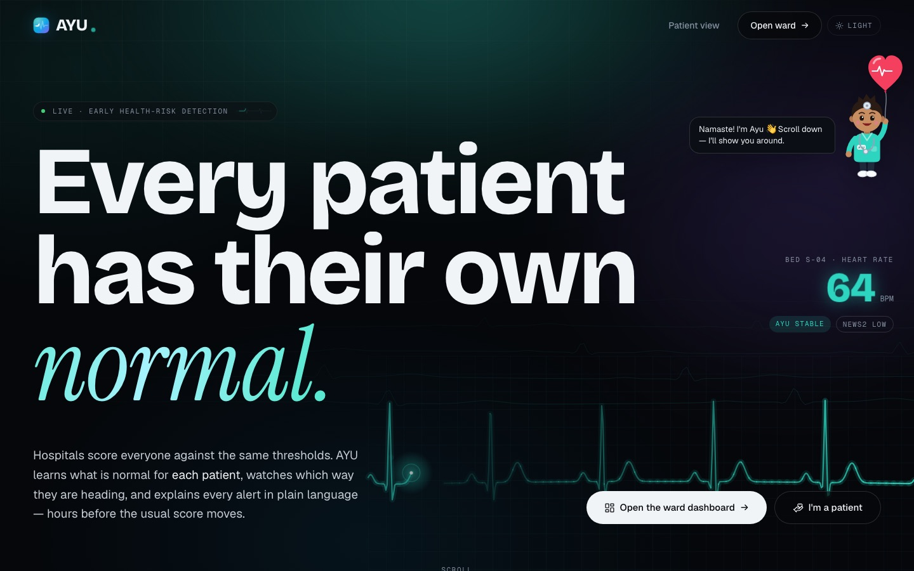

## The problem

Early warning scores like NEWS2 compare every patient with the same fixed thresholds. That fails in three ways:

- **Slow deterioration hides inside "normal".** SpO₂ sliding from 97% to 93% over three hours still scores *Low*, and a
  runner whose resting heart rate is 52 can reach 85 before NEWS2 notices anything.
- **Some patients live on the thresholds.** A heart-failure or COPD patient trips alarms on a quiet day, and staff learn
  to ignore them.
- **It is blind to medicines and symptoms.** Missed insulin, a missed blood-pressure tablet or chest pain are not part
  of NEWS2 at all.

## What AYU does

**Early warning, explained**
- Scores every patient **0–100** from NEWS2, a qSOFA sepsis screen, the patient's **own 7-day baseline**, a **3-hour
  trend**, missed critical doses and symptoms. Every point is a named factor; the factors add up to the score.
- **Never less alarming than NEWS2** — escalation floors lift AYU to at least NEWS2's level.
- **Alerts** once, escalating in place (no spam); a single odd reading can't raise one.
- **Explains** every score for the doctor and the patient, in **English or हिंदी**, via Gemini with an instant offline fallback.

**Real data in — not just a simulation**
- **Upload a report:** a PDF, a **photo of a handwritten slip** (JPG/PNG/HEIC) or pasted text. Gemini reads it into a
  draft in ~3 s (offline, AYU reads PDFs and text itself); the clinician checks every value and adds the patient.
- **Patients register themselves** (`/register`, English/हिंदी) — with tap-along pulse and breathing counters, a
  report reader and consent — or join by **scanning a QR code** on the ward screen.
- **ASHA workers** record readings, symptoms and doses for patients on a shared phone.
- A patient added this way is **never simulated**: their risk comes only from real readings, and AYU says when data is thin.

**For the doctor**
- A live **ward** (cards or a records table) and an **AI risk & smart-alert command center** ranking Critical → High →
  Moderate, each with a **confidence** indicator, **data quality**, the main factors and any sudden vital change.
- A tabbed patient profile: **Overview** (recent changes, mood & wellbeing, medical history), **Trends** (24 h / 7 d /
  30 d with zoom and the personal baseline), **Medications** (calendar, adherence, **missed-dose patterns** by time and
  weekday), a **longitudinal timeline**, and **Notes & care** (patient-visible or private notes, follow-ups,
  appointments, **video consults**).

**For the patient**
- A health dashboard: a glowing heart that follows their trends, an AI summary (never a diagnosis) with a **Listen / सुनें**
  button, vitals and adherence, prescriptions and doses, weather-aware wellness tips, a daily check-in, a symptom tracker,
  smart alerts in plain words, their care team's status, a personal timeline, and an **"Ask AYU"** assistant that sends
  red flags straight to "call a nurse / 108".

**A network, not one hospital**
- Hospitals and PHCs on one AYU. Each patient is **assigned a doctor** by a transparent rule (specialty, then
  acuity-weighted load), with the reason in words. Doctors can reassign; a doctor going **off duty hands patients over**
  automatically; a patient can be **referred** PHC → hospital with their whole record.

## Results

`/evaluation` runs every deterioration scenario on the patients it suits over 5 seeds (55 runs, 8 hours each), and every
patient at rest for 50 patient-days, comparing like with like on two tiers:

| | Urgent review — NEWS2 ≥ 5 vs AYU Warning | First alert — NEWS2 ≥ 5 or a single 3 vs AYU Watch (confirmed) |
|---|---|---|
| **Median head start for AYU** | **65 min** (0 min – 4.6 h) | **88 min** |
| AYU first · tied · NEWS2 first | **48 · 7 · 0** | 50 · 0 · 5 |
| NEWS2 never escalated (of 55) | 6 — all missed insulin | 5 |
| False alarms at rest (50 patient-days) | AYU 2 · NEWS2 2 | **AYU 0 · NEWS2 5** |

| Scenario (urgent tier) | NEWS2 | AYU | Head start |
|---|---|---|---|
| Sepsis | 2.7 h | 2.0 h | 50 min |
| Hypoxia | 2.9 h | 2.6 h | 13 min |
| Hypertensive crisis | 3.9 h | 1.7 h | 2.3 h |
| Cardiac event | 2.8 h | 1.5 h | 75 min |
| Missed medication | 6.2 h (never in 6/10) | 2.5 h | 4.1 h |

**Synthetic data, not clinical validation.** Reproduce with `GET /eval/lead-time` or
[`backend/app/eval/leadtime.py`](backend/app/eval/leadtime.py). Method in [`docs/TECHNICAL.md`](docs/TECHNICAL.md#7-evaluation).

## Screenshots

| | |
|---|---|
| **Ward** — live, sorted by risk, with alerts 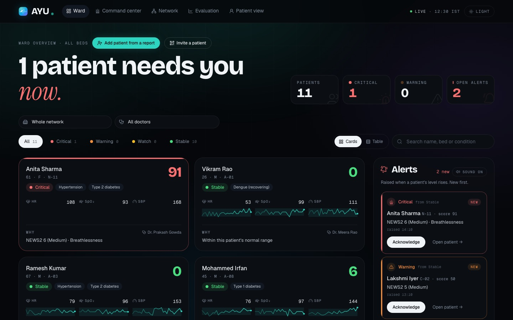 | **Command center** — prioritised queue with confidence and data quality 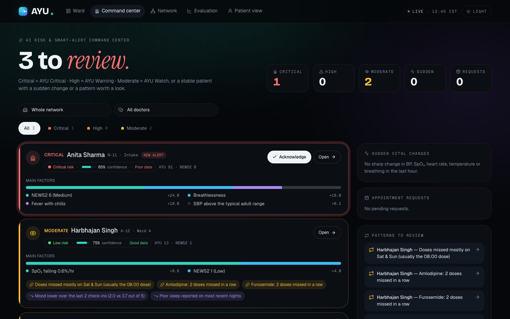 |
| **Patient profile** — score, factors, care team 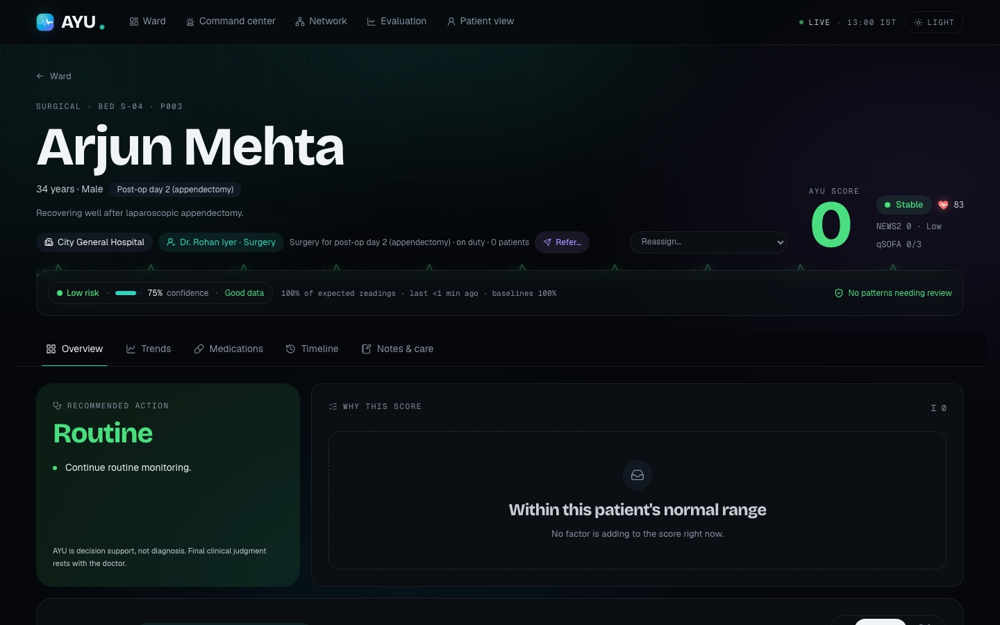 | **Trends** — 24 h / 7 d / 30 d against the personal baseline 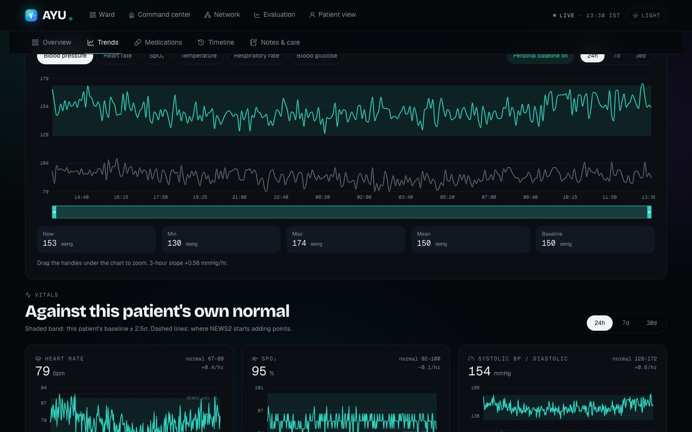 |
| **Medications** — calendar and missed-dose patterns 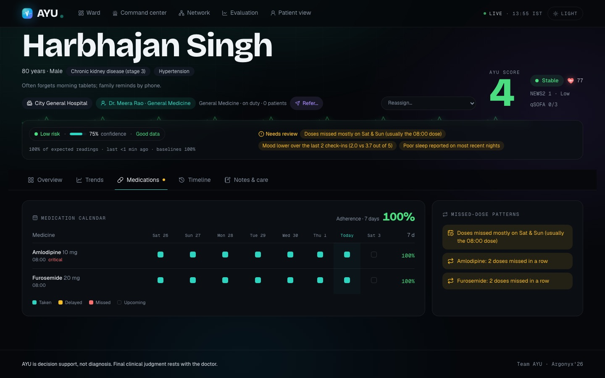 | **Network** — sites, doctors, load, on/off duty 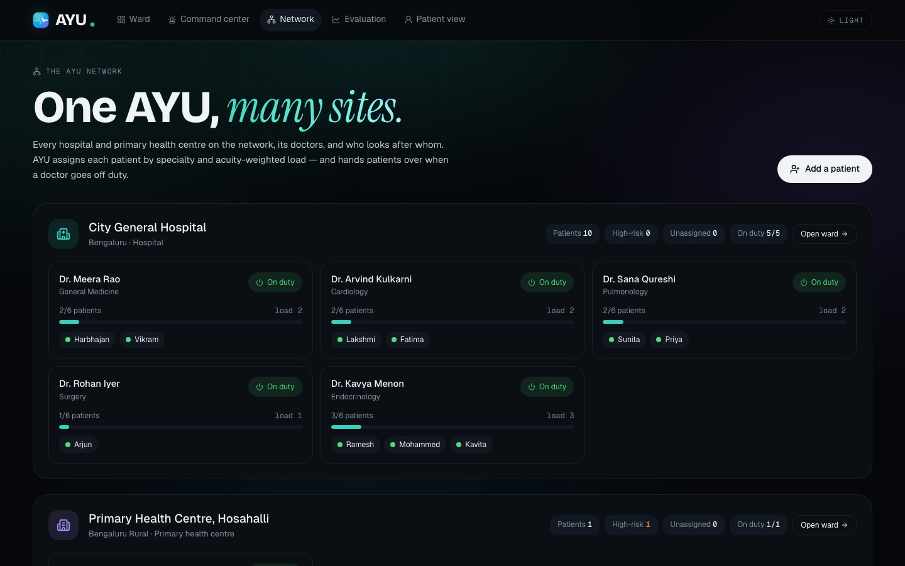 |
| **Report intake** — fields found in the report are tagged 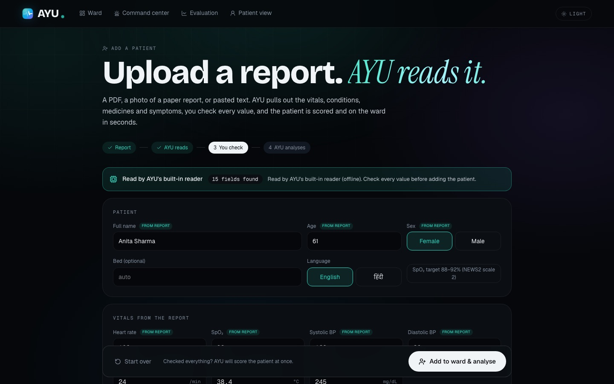 | **Analysed at once** — level, NEWS2, factors, alert 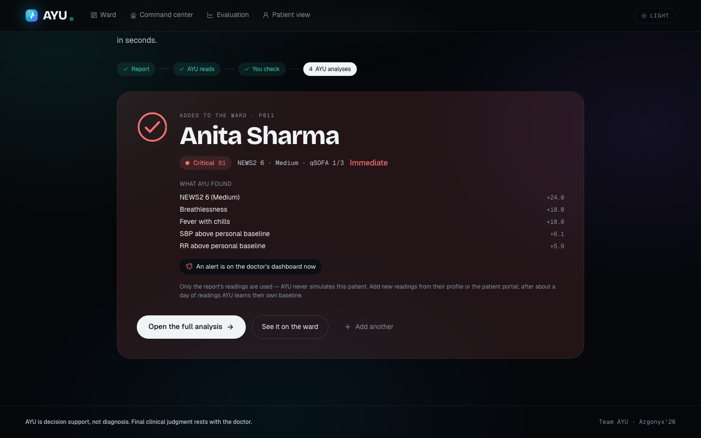 |
| **Patient dashboard** 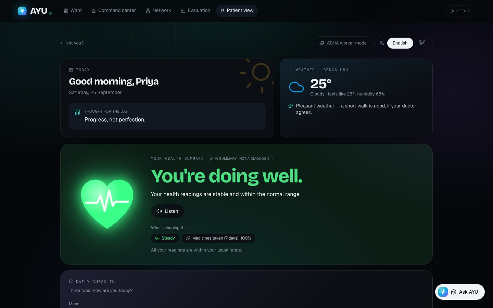 | **Evaluation** — the proof 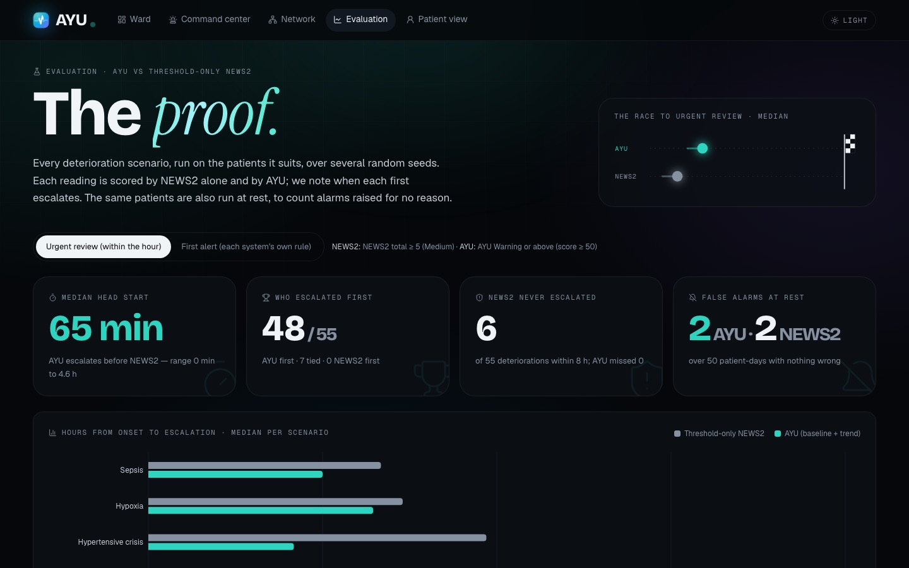 |

<p align="center">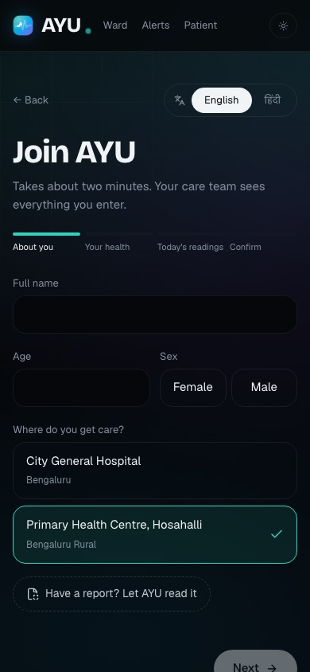 &nbsp; 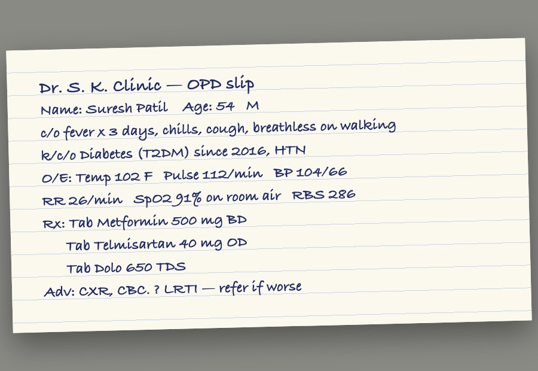</p>

## Quick start

```bash
./run.sh          # development: API on :8000, app with hot reload on :5173   (Windows: run.bat)
./serve.sh        # production build: app + API together on http://localhost:8000
```

- First start creates `backend/.venv` (Python 3.11, via `uv` if installed), copies `.env.example` → `.env`, seeds a
  demo network (2 sites, 6 doctors, 10 patients with 7 days of 5-minute vitals) and installs the frontend (Node 18+).
- Works fully offline. Add `GEMINI_API_KEY` to `.env` for Gemini explanations, the assistant and photo reading.
- Routes: `/` landing · `/doctor` ward · `/command` command center · `/network` · `/intake` add a patient ·
  `/patients/:id` profile · `/patient` patient portal · `/register` self-registration · `/evaluation` · `/demo` stage controls
- API docs: **http://localhost:8000/docs**

**A public link** (for phones and the QR code), with the app served by `./serve.sh`:

```bash
cloudflared tunnel --url http://localhost:8000
```

**Deploy as one container:** `docker build -t ayu . && docker run -p 8000:8000 --env-file .env ayu`, or connect the
repo to Render — [`render.yaml`](render.yaml) is included (paste `GEMINI_API_KEY` in the dashboard).

**Before going on stage:** open `/demo` and press **Reset** — fresh history, no alerts, 1× speed, whole-network view.

```bash
cd backend && .venv/bin/pytest            # 214 tests
cd frontend && npm run build              # typecheck + production build
cd backend && .venv/bin/python -m app.seed.seed          # re-seed and print each patient's risk
cd backend && .venv/bin/python -m app.intake.pdfmake     # regenerate samples/sample-admission-report.pdf
```

| Setting (`.env`) | Default | What |
|---|---|---|
| `GEMINI_API_KEY` | empty | Enables Gemini; without it AYU's built-in explanations, answers and PDF/text reader are used |
| `GEMINI_MODEL` · `GEMINI_FALLBACK_MODELS` | `gemini-3.1-flash-lite` · `gemini-3.6-flash,gemini-3.7-flash` | Text (explanations, assistant), tried in order |
| `GEMINI_VISION_MODEL` · `GEMINI_VISION_FALLBACK_MODELS` | `gemini-3.1-flash-lite` · `gemini-3.6-flash,gemini-3.7-flash,gemini-3.8-flash` | Reports and photos, tried in order |
| `GEMINI_TIMEOUT_S` | `6` | AYU's wait per call before its own answer takes over |
| `SIM_TICK_SECONDS` · `SIM_MINUTES_PER_TICK` | `2` · `5` | Live ward pace at 1× |
| `AYU_SEED` · `AYU_HISTORY_DAYS` · `AYU_EVAL_SEEDS` | `42` · `7` · `5` | Deterministic demo data and evaluation |
| `VITE_API_URL` | `http://127.0.0.1:8000` in dev | Where the app finds the API (a production build uses its own origin) |

## API (43 REST endpoints + a WebSocket — full list at `/docs`)

| Area | Endpoints |
|---|---|
| Patients & risk | `GET /patients` · `GET /patients/{id}` · `/risk` · `/risk/history` · `/vitals` · `/medications` · `/symptoms` · `/explanation?lang=en\|hi` |
| Patient input | `POST /patients/{id}/vitals` · `/symptoms` (severity, duration, frequency) · `/checkins` · `/chat` · `POST /doses` |
| Intake | `POST /intake/extract` (PDF / photo / text → draft) · `POST /patients` (create; clinician or self-registration) |
| Doctor | `GET /insights` (review queue) · `/patients/{id}/insights` · `/timeline` · `/notes` · `/appointments` · `POST /appointments/{id}` |
| Alerts | `GET /alerts` · `POST /alerts/{id}/ack` · `/resolve` |
| Network | `GET /hospitals` · `GET /doctors` · `POST /patients/{id}/assign` · `/refer` · `POST /doctors/{id}/duty` |
| Evaluation & demo | `GET /eval/lead-time` · `/sim` · `/sim/scenario` · `/speed` · `/pause` · `/resume` · `/step` · `/reset` · `WS /ws/live` · `GET /health` |

## Project layout

```
backend/app/
  risk/       the engine: weights.py (every number), news2, qsofa, baseline, trend, adherence, symptoms, engine
  explain/    gemini.py (model chain), service.py (explanations), assistant.py (chat), templates.py (built-in EN/HI)
  intake/     extract.py (report reader: Gemini or built-in rules), pdfmake.py (sample report)
  services/   insights (confidence, data quality, sudden changes, patterns), assign (doctor assignment), context, hub
  sim/        live simulator + scenarios (alert rules, hysteresis, cooldown, dose schedule)
  eval/       lead-time evaluation against threshold-only NEWS2
  seed/       demo network: sites, doctors, patients, history, check-ins
  api/        patients, intake, doctor, network, alerts, sim, eval, ws
backend/tests/   214 tests
frontend/src/
  pages/       Landing, Doctor (ward), CommandCenter, Network, Intake, PatientDetail, PatientPortal, Register, Evaluation, Demo
  components/  DoctorKit, PatientDashboard, PatientCare, NetworkKit, alerts, charts, VitalField (hero), HospitalStory,
               Buddy (mascot), Logo, Speak, InviteQR, illustrations, UI kit
  lib/         api client, live WebSocket store, scope (site/doctor), types, formatting, theme
docs/          TECHNICAL.md, screenshots
samples/       a synthetic admission report (PDF) for the offline demo
```

## Honest limits

- The 10-patient ward is **simulated** so a deterioration can be shown live; patients added from reports or who register
  themselves are **real input, never simulated**.
- The evaluation is on synthetic physiology — **not clinical validation**. The confidence indicator is a transparent
  heuristic, not a calibrated probability.
- No login or roles yet (a demo mode); SQLite in one process. Gemini needs the internet; everything else works offline.

## Future scope

- **Login and roles** (doctor, nurse, admin, patient, ASHA) with per-site data isolation and an audit log.
- **ABHA / ABDM** identity and consent so a record follows the patient across sites; FHIR for hospital EHRs.
- **Wearables and bedside monitors** for continuous vitals; **WhatsApp / SMS** alerts and dose reminders.
- **Clinical validation** — retrospective on real ward data, then a prospective pilot.

## Team

Ishan Sharma (lead) · Aryan Verma · Harshit Kandpal · Vinay — Team AYU, Argonyx'26.

---

⚠️ **AYU is decision support, not diagnosis. Final clinical judgment rests with the doctor.**
