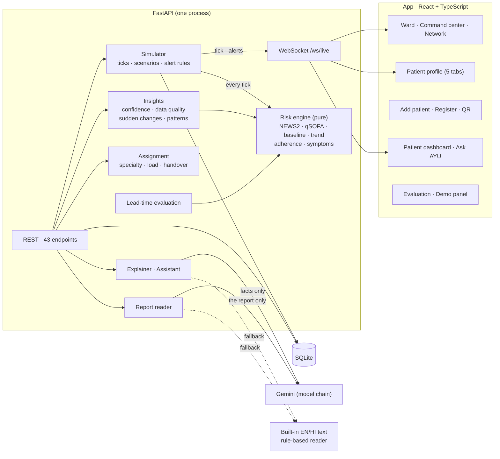

# AYU — Technical deep-dive

How AYU is built: every tool and why it was chosen, how each part works, the algorithms with their actual numbers, and
how the code was written and tested. Everything here matches the code in this repository; file paths are given so any
claim can be checked.

> ⚠️ AYU is decision support, not diagnosis. Final clinical judgment rests with the doctor.

**Contents**
1. [The stack and why](#1-the-stack-and-why)
2. [Architecture](#2-architecture)
3. [Data model](#3-data-model)
4. [The risk engine](#4-the-risk-engine)
5. [The live ward (simulator)](#5-the-live-ward-simulator)
6. [Alerts](#6-alerts)
7. [Evaluation](#7-evaluation)
8. [Gemini: where AI is used, and where it is not](#8-gemini-where-ai-is-used-and-where-it-is-not)
9. [Real data in: report intake and self-registration](#9-real-data-in-report-intake-and-self-registration)
10. [Doctor insights: confidence, data quality, sudden changes, patterns](#10-doctor-insights)
11. [The network: sites, doctor assignment, referral](#11-the-network-sites-doctor-assignment-referral)
12. [The frontend](#12-the-frontend)
13. [Testing and CI](#13-testing-and-ci)
14. [Running and deploying](#14-running-and-deploying)
15. [Privacy, safety and honest limits](#15-privacy-safety-and-honest-limits)
16. [How we built it](#16-how-we-built-it)

---

## 1. The stack and why

| Layer | Tool | Why this one |
|---|---|---|
| API | **FastAPI** 0.141 + **Uvicorn** | Async (the live ward, WebSockets and Gemini calls run concurrently), typed request/response models, and interactive docs at `/docs` for free. |
| Models & DB | **SQLModel** 0.0.47 on **SQLAlchemy** 2.0, **SQLite** | One file, zero setup, runs offline on a laptop at a PHC. SQLModel gives one class for the table and the Pydantic shape. `DATABASE_URL` can point at Postgres. |
| Validation | **Pydantic** 2 | Every input is range-checked at the edge (vitals, symptoms, times, consent). |
| Live updates | **WebSocket** (`/ws/live`) | The ward pushes each tick, alert and change to every open screen; no polling for live data. |
| AI | **Google Gemini** via `google-genai` 2.25 | Multimodal (reads PDFs and photos of handwritten slips), fast (`flash-lite` ≈ 2 s for text, ≈ 3 s for a photo), JSON output mode. |
| PDFs | **pypdf** | Pure Python, reads a PDF's text offline for the built-in reader. |
| Tests | **pytest** | 214 tests; FastAPI's `TestClient` drives the real app against a throwaway database. |
| App | **React 18** + **TypeScript** 5.9 + **Vite** 8 | Typed end to end (API types mirror the backend schemas); Vite for instant dev reloads and a small production build. |
| Routing | **React Router** 7 | Each screen is lazy-loaded, so the landing page ships first. |
| Styling | **Tailwind CSS** 4 with CSS variables | One set of design tokens (`--teal`, `--critical`, …) for dark and light themes. |
| Charts | **Recharts** 3 | Interactive vitals charts with reference bands (personal baseline) and a zoom brush. |
| Motion | **framer-motion** 13 | Page transitions, scroll-driven stories, springy lists; everything honours "reduce motion". |
| Icons | **lucide-react** | One icon per idea, used consistently (a vital always wears the same icon). |
| Extras | Canvas 2D (hero monitor), SVG (illustrations, mascot, logo), **Web Speech API** (read aloud), **qrcode** | No image files: everything is drawn, themeable and works offline. |
| CI | **GitHub Actions** | Every push runs the backend tests (Python 3.11) and the frontend typecheck + build (Node 22). |
| Deploy | Docker, Render blueprint, **cloudflared** tunnel | One container serves app + API; a tunnel gives the laptop a public HTTPS link for phones. |

## 2. Architecture

- **One engine everywhere.** The live ward, the patient dashboard, explanations, insights and the evaluation all call the
  same pure function, `risk.assess(PatientContext) → RiskResult` ([`backend/app/risk/engine.py`](../backend/app/risk/engine.py)).
  What judges see live is what the evaluation measured.
- **In-memory state, written through.** The simulator keeps each patient's recent readings, doses and risk in memory
  (fast reads for the API and WebSocket) and writes every reading, risk snapshot, dose and alert to SQLite.
- **Offline-first.** Nothing external is needed to run; Gemini improves wording and reads photos when it is reachable.

## 3. Data model

[`backend/app/models.py`](../backend/app/models.py) — SQLModel tables:

| Table | Holds |
|---|---|
| `Hospital` | A site on the network: hospital, PHC or clinic |
| `Doctor` | Name, specialty, site, on duty, capacity |
| `Patient` | Demographics, conditions, declared normals, NEWS2 SpO₂ scale, history, **source** (`demo` simulated · `intake` real), site, assigned doctor + reason, registered by (`seed` · `clinician` · `self`) |
| `VitalReading` | HR, SpO₂, SBP/DBP, RR, temperature, glucose, on-oxygen, consciousness, **source** (`sim`, `patient`, `asha`, `staff`, `report`) |
| `Medication` · `DoseEvent` | Prescriptions (times, critical flag) and each scheduled dose (pending · taken · missed, with time taken) |
| `SymptomReport` | Symptom key, severity, duration, frequency, source, note |
| `DailyCheckin` | Mood 1–5, energy 1–3, sleep 1–3, note |
| `RiskSnapshot` | Score, level, NEWS2, qSOFA over time |
| `Alert` | Level, previous level, factors, status (new · acknowledged · resolved), who acknowledged, note, timestamps |
| `DoctorNote` · `Appointment` | Notes (visible to the patient or private), follow-ups, appointment requests, video links |

If the schema changes, the app rebuilds the demo data on start (`schema_is_current()` in `db.py`), so a stale database
never breaks the demo.

## 4. The risk engine

`backend/app/risk/` is pure Python — no database, no web framework — and **every number lives in
[`weights.py`](../backend/app/risk/weights.py)**, so a clinician can audit the whole score on one page.

`score = NEWS2 + qSOFA + baseline deviations + trends + medication + symptoms` (each group capped), then raised to any
escalation floor. The factor contributions always add up to the score.

| # | Component | How | Points |
|---|---|---|---|
| 1 | **NEWS2** ([`news2.py`](../backend/app/risk/news2.py)) | The Royal College of Physicians chart, exactly; SpO₂ scale 2 for a prescribed 88–92% target (COPD). | 4 per NEWS2 point (cap 40); +6 if any single parameter scores 3 |
| 2 | **qSOFA** ([`qsofa.py`](../backend/app/risk/qsofa.py)) | RR ≥ 22, SBP ≤ 100, altered mentation; ≥ 2 = sepsis-risk flag | 15 when flagged |
| 3 | **Personal baseline** ([`baseline.py`](../backend/app/risk/baseline.py)) | **Median and MAD × 1.4826** of the last **7 days, excluding the last 6 h** (so a slow decline can't teach itself "normal"); at least 24 readings, else the declared normals. "Now" = mean of the last 3 readings. Flag when \|z\| ≥ **2.5** or ≥ **20%** away, in the concerning direction. | Up to 16 (SpO₂), 12 (HR, RR, SBP), 10 (temp, glucose), 6 (DBP), scaled by \|z\|/5; cap 35 |
| 4 | **Trend** ([`trend.py`](../backend/app/risk/trend.py)) | Least-squares slope over the last **3 h** (≥ 8 points). The slope's standard error is **widened for autocorrelation**: `se × √((1 + r) / (1 − r))` with r the lag-1 autocorrelation of residuals (capped 0.9). Flag only when the slope passes a per-vital threshold (e.g. SpO₂ −0.5 %/h, HR ±4 bpm/h, temp +0.3 °C/h) **and** is ≥ **3 standard errors** from zero. | Up to 14 (SpO₂), 10 (HR, RR, SBP), 8 (temp, glucose), 5 (DBP); full at 2× the threshold; cap 30 |
| 5 | **Medication** ([`adherence.py`](../backend/app/risk/adherence.py)) | 7-day adherence below 90%; a *critical* medicine missed in the last 24 h (a pending dose 2 h late counts as missed) | Up to 12 + 8 per missed critical dose; cap 20 |
| 6 | **Symptoms** ([`symptoms.py`](../backend/app/risk/symptoms.py)) | Weighted symptoms from the last 12 h (chest pain 30 … cough 4) | Cap 35 |

**Levels:** Stable 0–24 · Watch 25–49 · Warning 50–74 · Critical 75–100.
**Escalation floors — AYU is never less alarming than the hospital standard:** NEWS2 ≥ 7 → Critical · NEWS2 5–6 → Warning ·
any single NEWS2 parameter at 3 → Watch · qSOFA ≥ 2 → Warning · a red-flag symptom (chest pain, one-sided weakness,
slurred speech, fainting, new confusion, coughing blood) → Critical.

**Why the autocorrelation correction matters:** readings minutes apart are not independent, so the ordinary standard error
is far too small and a resting patient "trends" constantly. A plain 2-hour slope flagged trends in ~**20%** of checks on
resting patients; the 3-hour window with the widened error brought that to ~**0.1%**, while a 1 %/h SpO₂ fall is still caught.

**Honest wording for new patients:** a patient added from a report starts on population normals, so their factors say
"SBP above **the typical adult range**" instead of claiming a personal baseline, until AYU has learned one from their readings.

## 5. The live ward (simulator)

[`backend/app/sim/simulator.py`](../backend/app/sim/simulator.py), [`scenarios.py`](../backend/app/sim/scenarios.py),
[`seed/physiology.py`](../backend/app/seed/physiology.py)

- **One tick = 5 simulated minutes**, every 2 s ÷ speed (1×, 5×, 20×). Each tick: new readings for every simulated
  patient → re-score → alert rules → one WebSocket message.
- **Realistic vitals:** each patient's own normal + a **circadian** swing + a **slow AR(1) wander** (φ = 0.97, "remembers"
  ~2.5 h, 35% of the spread) + **jitter** capped at ±2.5σ (an uncapped 4σ jitter once produced an SBP of 88 and a false alert).
- **Scenarios** add steady per-hour offsets and timed events: sepsis (HR, temp, RR up, BP down, fever, later confusion),
  hypoxia, hypertensive crisis, cardiac event, missed medication, and recover.
- **Doses** are scheduled 36 h ahead and taken on time unless a scenario skips critical ones.
- **Real patients are never simulated:** patients added from a report or by registration (`source = intake`) are skipped
  by the tick loop; their history grows only with real readings.
- A **new or escalated alert drops the speed back to 1×**, so a fast-forwarded demo slows down at the moment worth watching.

## 6. Alerts

- A rise to **Warning or Critical alerts at once**; a rise to **Watch must hold on the next reading** (one odd reading can't page a doctor).
- **One open alert per patient**, escalated in place (Watch → Warning → Critical) — no spam.
- **Hysteresis:** the held level drops only after 3 lower readings, so a score on a boundary can't flap.
- **Cool-down:** after an alert is resolved, the same patient can't re-alert at the same or a lower level for 30 simulated minutes.
- A patient **admitted at Watch or worse** (from a report or self-registration) raises an alert at once.
- New → Acknowledged (with the doctor's name and note, shown to the patient as "seen by your care team") → Resolved.

## 7. Evaluation

[`backend/app/eval/leadtime.py`](../backend/app/eval/leadtime.py) — reproducible with `GET /eval/lead-time`.

1. For each scenario, on each patient it suits, over **5 seeds**: generate 7 days of that patient's normal readings (the
   same generator as the live ward), inject the scenario (the same definitions as the demo), and step 5 minutes at a time for **8 h**.
2. Score every tick with the AYU engine and with NEWS2 alone, and record when each first escalates, on two tiers so like
   is compared with like:
   - **Urgent review:** NEWS2 ≥ 5 vs AYU Warning (both mean "review within the hour").
   - **First alert:** NEWS2 ≥ 5 or a single 3 vs AYU Watch confirmed on the next reading.
3. Run every patient **at rest** for 50 patient-days to count false alarms.

Results: median **65 min** earlier to urgent review; AYU first in **48/55**, tied 7, NEWS2 first **0**; NEWS2 never
escalated on 6 missed-insulin runs; false first alerts at rest **0 vs 5**. Symptoms count for AYU only, since NEWS2 does
not use them by design. **Synthetic physiology — not clinical validation.**

## 8. Gemini: where AI is used, and where it is not

**The risk score is never produced by AI.** The engine decides; Gemini reads and explains.

| Use | File | What Gemini gets | What it returns | Fallback |
|---|---|---|---|---|
| **Explanations** (doctor + patient, EN/HI) | [`explain/service.py`](../backend/app/explain/service.py) | Level, score, urgency, NEWS2/qSOFA, the top factors — **no name, age, bed or ID** (a test checks this) | JSON `{doctor, patient, urgency}`; Hindi must contain Devanagari | Built-in EN/HI generated from each factor's structured data ([`templates.py`](../backend/app/explain/templates.py)) |
| **"Ask AYU" assistant** | [`explain/assistant.py`](../backend/app/explain/assistant.py) | The patient's conditions, readings with their normal range, medicines, next dose, adherence, recent symptoms, risk factors — **no identifiers** | ≤ 4 simple sentences; told never to diagnose or change a medicine | Keyword intents answered from the same facts |
| **Reading reports / photos** | [`intake/extract.py`](../backend/app/intake/extract.py) | The uploaded PDF or photo itself (only that) | Strict JSON draft: name, age, sex, conditions, medicines with times, vitals, symptoms, history, impression | Built-in reader for PDF text / pasted text; a photo offline says it needs Gemini |

**Safety before the model:** red-flag words ("chest pain", "can't breathe", "सीने में दर्द", …) get a fixed reply —
*tell a nurse now or call 108* — **before any model is asked**.

**Reliability** ([`explain/gemini.py`](../backend/app/explain/gemini.py)):
- A **chain of models**: text `gemini-3.1-flash-lite → 3.6-flash → 3.7-flash`; reports/photos
  `3.1-flash-lite → 3.6-flash → 3.7-flash → 3.8-flash`. A busy (503), rate-limited (429), retired (404) or timed-out
  model falls through to the next at once; the reply names the model that answered.
- The API's minimum deadline is 10 s; AYU keeps its own shorter wait (`GEMINI_TIMEOUT_S`, ×2 for the chain) and after any
  failure skips Gemini for 60 s, so a dropped network costs one wait, not one per click.
- Replies are validated (JSON shape, length, Devanagari for Hindi) and good explanations are cached per risk picture.

## 9. Real data in: report intake and self-registration

**Report intake** (`/intake`, [`api/intake.py`](../backend/app/api/intake.py), [`intake/extract.py`](../backend/app/intake/extract.py)):
1. The browser sends the file as base64 (PDF, JPG, PNG, WEBP, **HEIC** — the type falls back to the extension, since
   browsers often send iPhone photos with none), up to 8 MB, or pasted text.
2. **Gemini** reads it (≈ 3 s for a handwritten slip), or AYU's **built-in reader** parses the text: labelled vitals
   (`BP 168/98`, `Pulse`, `SpO2`, `RR`, `Temp 101.2 F` → °C, `RBS`), ~20 known conditions, medicine lines
   (`Tab Metformin 500 mg BD` → 08:00 and 20:00; OD / BD / TDS / QID / HS), symptoms **with negation** ("denies chest
   pain" is not chest pain), `2019 – …` history lines and the impression.
3. `clean_draft()` **range-checks every value** (HR 20–250, SpO₂ 50–100, …), converts °F, keeps only known symptoms,
   and never invents anything missing.
4. The clinician reviews a pre-filled form — fields found in the report are tagged, missing core vitals are flagged — and adds the patient.
5. `POST /patients` creates the patient (`source = intake`, population normals), stores the report's reading
   (`source = report`), medicines and symptoms, scores them at once, alerts if they arrive at Watch or worse, and
   **assigns a doctor**. A private note records how they were added.

**Self-registration** (`/register`): the same endpoint with `source = self` and **consent required**. The patient picks
their site, can let AYU read a report to pre-fill, and can **count their pulse (15 s) and breathing (30 s) by tapping**
along — scaled to per minute — so no special device is needed. The doctor's queue asks for their details to be verified.
A **QR code** on the ward (`Invite a patient`) points phones at `/register` on whatever address AYU is served from.

## 10. Doctor insights

[`services/insights.py`](../backend/app/services/insights.py), [`api/doctor.py`](../backend/app/api/doctor.py) — none of this
changes the score; it helps a doctor decide what to look at first.

- **Data quality:** completeness (readings in the last hour ÷ 12 expected), freshness (minutes since the last reading),
  baseline coverage (share of key vitals with a learned baseline). Good · Fair · Poor, with reasons.
- **Confidence** (0–100, clamped 35–95) — a **transparent heuristic, not a calibrated probability**, and labelled as such:
  40 + data quality (Good 25 · Fair 12 · Poor 0) + independent kinds of signal agreeing (5 each, up to 15) + distance of
  the score from a level boundary (up to 10) + 10 if a hospital rule (NEWS2 / qSOFA / red flag) set the level.
- **Sudden changes:** a vital that moved sharply within ~1 h (SBP ±20, SpO₂ −3, HR ±20, temp ±0.8 °C, RR ±6), or a
  reading outside a safe range (SpO₂ < 92, or < 88 on scale 2; HR 45–125; …). High when the move is 1.5× the threshold.
- **Missed-dose patterns:** the same medicine at the same time missed ≥ 2 times and ≥ 30% of the time; misses clustered
  on the same weekdays across **at least two different dates** (one bad morning is not a pattern); runs of consecutive
  misses; a critical medicine missed in the last 48 h. Only patterns involving critical medicines ask for a doctor.
- **Mood:** self-reported check-ins — a clear drop over the last two, or poor sleep on most recent nights (an indicator, not a screening tool).
- **Review queue** (`GET /insights`): Critical = AYU Critical, High = Warning, Moderate = Watch **or** a stable patient
  with a sudden change or a pattern worth a look; sorted by priority then score.

## 11. The network: sites, doctor assignment, referral

[`services/assign.py`](../backend/app/services/assign.py), [`api/network.py`](../backend/app/api/network.py)

**Assignment rule** (pure function, every choice explained in words):
1. **Specialty** from the conditions, first match wins: post-op → Surgery; heart → Cardiology; COPD/asthma/pneumonia →
   Pulmonology; diabetes/thyroid → Endocrinology; else General Medicine.
2. Among **on-duty** doctors at the patient's site: +100 for the matching specialty, +40 for General Medicine;
   −6 × **acuity-weighted load** (each patient counts Critical 4 · Warning 3 · Watch 2 · Stable 1); −1000 if at capacity
   (only chosen if nobody else can); −60 if the patient is sick and the doctor already has ≥ 2 sick patients.
3. The reason is stored, e.g. *"Cardiology for heart failure · on duty · 2 patients"* or *"General Medicine (no cardiology doctor on duty here)"*.

**Overrides and handover:** a doctor can reassign (or "let AYU choose"). Putting a doctor **off duty** hands their patients
over by the same rule, **sickest first**, and each patient gets a note "Your doctor is now …".
**Referral:** `POST /patients/{id}/refer` moves a patient to another site (e.g. PHC → district hospital); readings,
medicines, symptoms, notes and alerts stay attached, and AYU assigns a doctor there.

## 12. The frontend

`frontend/src/` — React + TypeScript, ~9.8k lines.

- **Screens** (`pages/`): Landing, Ward (`Doctor`), Command center, Network, Intake, Patient profile (5 tabs), Patient
  dashboard (`PatientPortal`), Register, Evaluation, Demo panel, 404. Each is **lazy-loaded**.
- **Data:** `lib/api.ts` — a typed client and a small `useQuery` hook (loading/error/reload, optional polling, abort on
  unmount). `lib/live.ts` — **one shared WebSocket** for the whole app with reconnect and back-off; screens subscribe and
  re-fetch throttled (so 20× speed stays smooth). `lib/scope.ts` — the chosen site/doctor, shared by every screen.
- **Design system:** CSS variables for every colour (dark and light themes), risk colours reserved for risk, Bricolage
  Grotesque / Geist / Instrument Serif type, one icon map (`components/icons.tsx`) so a vital always wears the same icon.
- **Motion and art, no image files:** the hero is a Canvas 2D bedside monitor (one pen sweeping at paper speed, the heart
  rate rising as the trace turns amber); the landing's hospital builds itself on scroll (SVG + scroll-linked motion);
  Ayu the mascot rides the scroll and talks about the section in view; illustrations, the heart that glows green→red and
  the living logo are SVG. Everything respects `prefers-reduced-motion`.
- **Bilingual:** English and हिंदी for everything a patient sees (inline dictionaries); the status can be **read aloud**
  with the browser's Web Speech API (a Hindi voice where available), which works offline.
- **Resilience:** loading skeletons, empty and error states on every screen, an error boundary per page, and a QR code
  that warns when the app is on a `localhost` address phones can't reach.

## 13. Testing and CI

`backend/tests/` — **214 tests** (pytest), each against a fresh throwaway database:

| Area | What is tested |
|---|---|
| Engine | Every NEWS2 threshold; qSOFA; robust baselines and the 6-h lag; trends vs noise (autocorrelation); adherence; symptoms; floors; factors summing to the score |
| Simulator & alerts | Ticks, scenarios, one alert escalating in place, Watch confirmation, hysteresis, cool-down, reset, speed drop on alert, WebSocket snapshot + live messages |
| Evaluation | Tiers, "never" handling, reproducibility |
| Explanations & assistant | Gemini JSON validation, Hindi script check, caching, timeouts, cool-down, **no identifiers sent**, red flags before any model, the model fallback chain |
| Intake | The built-in reader on a real PDF, negations, °F, impossible values, HEIC by extension, photo-without-Gemini, creation, **never simulated**, "typical adult range" wording |
| Doctor & network | Insights, patterns, mood, review queue order, notes visibility, appointments + video links, assignment by specialty and load, off-duty handover, referral, self-registration with consent |

**CI** (`.github/workflows/ci.yml`) runs the backend tests on Python 3.11 and the frontend typecheck + production build on
Node 22 on every push.

## 14. Running and deploying

| Mode | Command | What happens |
|---|---|---|
| Development | `./run.sh` | API on :8000 (auto-seeds), app on :5173 with hot reload |
| Production, local | `./serve.sh` | Builds the app; **the API serves it** on :8000 — one address for everything |
| Public link | `cloudflared tunnel --url http://localhost:8000` | An HTTPS link to the laptop, for phones and the QR code |
| Container | `docker build -t ayu . && docker run -p 8000:8000 --env-file .env ayu` | Multi-stage build: Node builds the app, Python serves app + API |
| Render | connect the repo (`render.yaml`) | One web service from the Dockerfile; set `GEMINI_API_KEY` in the dashboard |

**How one server serves both** ([`main.py`](../backend/app/main.py)): when `frontend/dist` exists, a middleware serves
real files (`/assets/…`, the sample PDF) directly, and a browser opening a page (`Accept: text/html`, e.g. `/patients/P003`)
gets `index.html`, while the app's own requests (`Accept: application/json`) reach the API. That page is sent with
`Cache-Control: no-store` and `Vary: Accept`, because the same URL is also an API route and a cached page must never be
reused for the app's JSON request. The production build talks to the API on its own origin; WebSockets upgrade to `wss://` automatically.

**Why not Vercel for the API:** AYU runs a continuous simulator and keeps WebSockets open; serverless functions can't do
either, so the API needs an always-on process (a container, Render, or the laptop behind a tunnel).

## 15. Privacy, safety and honest limits

**Privacy and safety**
- Gemini never receives a patient's name, age, bed or ID for explanations or the assistant (tested). For intake, only the
  uploaded report is sent. The API key lives only in `.env`, which git ignores.
- AI never sets the risk score, never diagnoses, and never tells a patient to change a medicine; red flags skip the AI entirely.
- Every value from a report is range-checked, nothing missing is invented, and a clinician reviews the draft before saving.
- Real patients are never simulated; thin data is labelled ("Poor data", "typical adult range").

**Honest limits**
- The 10-patient ward is simulated so a deterioration can be shown live; the evaluation is synthetic — **not clinical validation**.
- The confidence indicator is a heuristic, not a calibrated probability.
- No login or roles yet (demo mode) and no per-site data isolation; SQLite in one process; the public link depends on the laptop.

**Next:** login and roles with an audit log, Postgres, ABHA/ABDM identity and consent, FHIR export, device integrations,
WhatsApp/SMS, and a retrospective then prospective clinical validation.

## 16. How we built it

- **Phase by phase**, stopping after each: (1) the risk engine with tests; (2) the live simulator, alert rules and
  WebSocket; (3) the doctor's ward and patient page; (4) explanations (Gemini + built-in Hindi) and the patient portal;
  (5) the lead-time evaluation. Then the redesign, the patient and doctor dashboards, report intake, self-registration,
  and the network.
- **Engine first, pure and tested.** `risk/` has no framework dependencies, so it was built test-first and is reused unchanged by the ward, the API and the evaluation.
- **Measured, then tuned.** The evaluation drove the design: the trend false-positive rate (20% → 0.1%), matched urgency
  tiers instead of comparing unequal triggers, capped jitter after a false alert, and the rule that AYU is never less alarming than NEWS2.
- **Small, reviewed commits.** 70+ commits, each one logical change with its tests, pushed regularly with CI green —
  the history in this repository is the build log.
- **Stage-safe by design.** Every external dependency (Gemini, the network) has an instant offline fallback, and the
  demo panel can reset the whole ward in one click.
